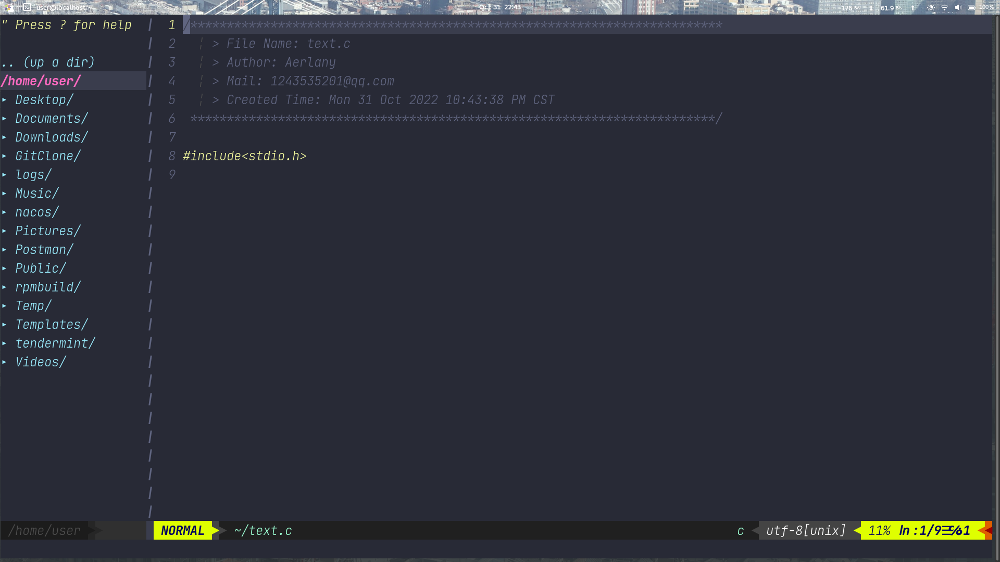
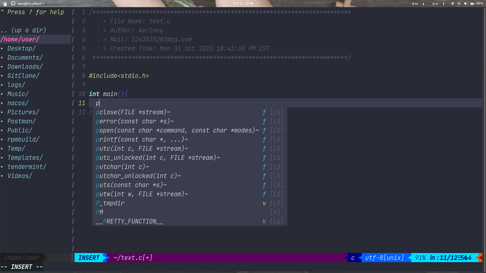

# Vim-extensions

### **我的一些Vim8.2或Vim9.0基础配置**

```tex
"==============================================================================
"  __  ____     ____      _______ __  __ _____   _____ 
"|  \/  \ \   / /\ \    / /_   _|  \/  |  __ \ / ____|
"| \  / |\ \_/ /  \ \  / /  | | | \  / | |__) | |     
"| |\/| | \   /    \ \/ /   | | | |\/| |  _  /| |     
"| |  | |  | |      \  /   _| |_| |  | | | \ \| |____ 
"|_|  |_|  |_|       \/   |_____|_|  |_|_|  \_\\_____|
"                                                     
"==============================================================================
let mapleader=" "
syntax on
set cursorline
set showcmd
set wrap
set number
set wildmenu

"搜索设置
set hlsearch
set incsearch
set ignorecase
set smartcase
exec "nohlsearch"

"关闭VI兼容
set nocompatible
" 侦测文件类型
filetype on
filetype indent on
filetype plugin on
filetype plugin indent on

set completeopt=longest,menu

"支持使用鼠标
set mouse=a
set encoding=utf-8
"防止终端运行vim的某些问题
let &t_ut=''
"tab键的相关操作
set expandtab
set tabstop=2

"空格和换行操作
set shiftwidth=2
set cindent
set autoindent

"设置空格提醒
set list
set listchars=tab:▸\ ,trail:▫

"屏幕始终距离边界5行
set scrolloff=5
set tw=0
set indentexpr=
set backspace=indent,eol,start

"允许文本折叠
set foldmethod=indent
set foldlevel=99

"状态栏
set laststatus=2

" 命令行（在状态行下）的高度，默认为1，这里是2
set cmdheight=1

"共享剪贴板  
set clipboard+=unnamed 

"光标在不同模式时有不同样式
if has("autocmd")
  au VimEnter,InsertLeave * silent execute '!echo -ne "\e[2 q"' | redraw!
  au InsertEnter,InsertChange *
    \ if v:insertmode == 'i' | 
    \   silent execute '!echo -ne "\e[6 q"' | redraw! |
    \ elseif v:insertmode == 'r' |
    \   silent execute '!echo -ne "\e[4 q"' | redraw! |
    \ endif
  au VimLeave * silent execute '!echo -ne "\e[ q"' | redraw!
endif


set autochdir
"光标处于上次关闭文件时的位置
au BufReadPost * if line("'\"") > 1 && line("'\"") <= line("$") | exe "normal! g'\"" | endif

map RC :source $MYVIMRC<CR>
map S :w<CR>
map Q :q<CR>
map <LEADER>q :q!<CR>
map J 5j
map K 5k
map s <nop>

"分屏设置
map sl :set splitright<CR>:vsp<CR>
map sh :set nosplitright<CR>:vsp<CR>
map sj :set splitbelow<CR>:sp<CR>
map sk :set nosplitbelow<CR>:sp<CR>

"分屏光标跳转
map <LEADER>j <C-w>j
map <LEADER>h <C-w>h
map <LEADER>l <C-w>l
map <LEADER>k <C-w>k

"分屏窗口大小改变
map <up> :res +5<CR>
map <down> :res -5<CR>
map <left> :vertical resize-5<CR>
map <right> :vertical resize+5<CR>

"分屏窗口位置改变
map sv <C-w>t<C-w>H
map sh <C-w>t<C-w>K

"打开新标签页
map fj :tabe<CR>
map fh :-tabnext<CR>
map fl :+tabnext<CR>

" 显示中文帮助
if version >= 603
    set helplang=cn
    set encoding=utf-8
endif

"c语言配置
nnoremap <F4> :!gcc % && ./a.out<CR>

set fencs=utf-8,ucs-bom,shift-jis,gb18030,gbk,gb2312,cp936
set termencoding=utf-8
set encoding=utf-8
set fileencodings=ucs-bom,utf-8,cp936
set fileencoding=utf-8"""""""""""""""""""""""""""""""""""""""""""""""""""""""""""""""""""""""""""""""""""""""""""""""""
"""""新文件标题""""""""""""""""""""""""""""""""""""""""""""""""""""""""""""""""""""""""""""""""""""""""""""""""
"新建.c,.h,.sh,.java文件，自动插入文件头 
autocmd BufNewFile *.cpp,*.[ch],*.sh,*.java exec ":call SetTitle()" 
""定义函数SetTitle，自动插入文件头 
func SetTitle() 
    "如果文件类型为.sh文件 
    if &filetype == 'sh' 
        call setline(1,"\#########################################################################") 
        call append(line("."), "\# File Name: ".expand("%")) 
        call append(line(".")+1, "\# Author: Aerlany") 
        call append(line(".")+2, "\# mail:1243535201@qq.com") 
        call append(line(".")+3, "\# Created Time: ".strftime("%c")) 
        call append(line(".")+4, "\#########################################################################") 
        call append(line(".")+5, "\#!/bin/bash") 
        call append(line(".")+6, "") 
    else 
        call setline(1, "/*************************************************************************") 
        call append(line("."), "    > File Name: ".expand("%")) 
        call append(line(".")+1, "    > Author: Aerlany") 
        call append(line(".")+2, "    > Mail: 1243535201@qq.com") 
        call append(line(".")+3, "    > Created Time: ".strftime("%c")) 
        call append(line(".")+4, " ************************************************************************/") 
        call append(line(".")+5, "")
        call append(line(".")+6, "#include<stdio.h>")
        call append(line(".")+7, "")
    endif
    "新建文件后，自动定位到文件末尾
    autocmd BufNewFile * normal G
endfunc 

set clipboard=unnamed
"插件安装
call plug#begin('~/.vim/plugged')

"状态栏插件
Plug 'vim-airline/vim-airline'
Plug 'vim-airline/vim-airline-themes'
"=========================================================================
" @airline
let g:airline_left_sep = '▶'
let g:airline_left_alt_sep = '❯'
let g:airline_right_sep = '◀'
let g:airline_right_alt_sep = '❮'
"=========================================================================

"主题
Plug 'connorholyday/vim-snazzy'

"=========================================================================
"nerd tree
Plug 'preservim/nerdtree'
nnoremap <F3> :NERDTreeToggle<CR>
map nt :NERDTreeToggle<CR>
autocmd vimenter * NERDTree
let g:NERDTreeWinSize = 20
"当nerdtree是唯一窗口时关闭
"autocmd bufenter * if (winnr("$") == 1 && exists("b:NERDTree") && b:NERDTree.isTabTree()) | q | endif
"========================================================================


"========================================================================
" coc
Plug 'neoclide/coc.nvim', {'branch': 'release'}
"coc配置
let g:coc_global_exentsions = [
     \'coc-json',
     \'coc-vimlsp' ]
"加快响应
set updatetime=100

"tab补全 and <CR>补全
inoremap <silent><expr> <TAB>
      \ coc#pum#visible() ? coc#pum#next(1) :
      \ CheckBackspace() ? "\<Tab>" :
      \ coc#refresh()
inoremap <expr><S-TAB> coc#pum#visible() ? coc#pum#prev(1) : "\<C-h>"


" Make <CR> to accept selected completion item or notify coc.nvim to format
" <C-g>u breaks current undo, please make your own choice.
inoremap <silent><expr> <CR> coc#pum#visible() ? coc#pum#confirm()
      \: "\<C-g>u\<CR>\<c-r>=coc#on_enter()\<CR>"
function! CheckBackspace() abort
  let col = col('.') - 1
  return !col || getline('.')[col - 1]  =~# '\s'
endfunction

"调出补全
" Use <c-space> to trigger completion.
if has('nvim')
  inoremap <silent><expr> <c-space> coc#refresh()
else
  inoremap <silent><expr> <c-@> coc#refresh()
endif

"查看报错地方
nmap <silent> <LEADER>- <Plug>(coc-diagnostic-prev)
nmap <silent> <LEADER>= <Plug>(coc-diagnostic-next)

"跳转函数
" GoTo code navigation.
nmap <silent> gd <Plug>(coc-definition)
nmap <silent> gy <Plug>(coc-type-definition)
nmap <silent> gi <Plug>(coc-implementation)
nmap <silent> gr <Plug>(coc-references)

" Use K to show documentation in preview window.
nnoremap <silent> <LEADER>k :call ShowDocumentation()<CR>

function! ShowDocumentation()
  if CocAction('hasProvider', 'hover')
    call CocActionAsync('doHover')
  else
    call feedkeys('K', 'in')
  endif
endfunction

" Highlight the symbol and its references when holding the cursor.
"autocmd CursorHold * silent call CocActionAsync('highlight')

"========================================================================

"========================================================================
Plug 'Yggdroot/indentLine'
"让json文件可以显示引号但是格式化线会样式出错"
"let g:indentLine_setConceal = 0
let g:vim_json_conceal=0
let g:indent_guides_guide_size= 1  " 指定对齐线的尺寸
let g:indent_guides_start_level= 2  " 从第二层开始可视化显示缩进


"========================================================================
"注释工具
"Plug 'scrooloose/nerdcommenter'
Plug 'preservim/nerdcommenter'

map <C-p> <LEADER>cc
map <C-o> <LEADER>cu

"========================================================================
"括号高亮
Plug 'luochen1990/rainbow'
let g:rainbow_active = 1
"========================================================================

"========================================================================
"vim-markdown 插件支持
Plug 'iamcco/markdown-preview.nvim', { 'do': { -> mkdp#util#install() }, 'for': ['markdown', 'vim-plug']}
" set to 1, nvim will open the preview window after entering the markdown buffer
" default: 0
let g:mkdp_auto_start = 0

" set to 1, the nvim will auto close current preview window when change
" from markdown buffer to another buffer
" default: 1
let g:mkdp_auto_close = 1

" set to 1, the vim will refresh markdown when save the buffer or
" leave from insert mode, default 0 is auto refresh markdown as you edit or
" move the cursor
" default: 0
let g:mkdp_refresh_slow = 0

" set to 1, the MarkdownPreview command can be use for all files,
" by default it can be use in markdown file
" default: 0
let g:mkdp_command_for_global = 0

" set to 1, preview server available to others in your network
" by default, the server listens on localhost (127.0.0.1)
" default: 0
let g:mkdp_open_to_the_world = 0

let g:mkdp_theme = 'light'

"========================================================================


call plug#end()


colorscheme snazzy

```

### 界面展示






### 使用插件罗列

1.[状态栏插件 Vim-airlin](https://github.com/vim-airline/vim-airline)

2.[主题 Vim-snazzy	](https://github.com/connorholyday/vim-snazzy)

3.[目录导航栏 nerdtree](https://github.com/preservim/nerdtree)

4.[代码补全 coc.nvim](https://github.com/neoclide/coc.nvim)

5.[注释工具 nerdcommenter](https://github.com/preservim/nerdcommenter)

6.[括号高亮 rainbow](https://github.com/luochen1990/rainbow)
